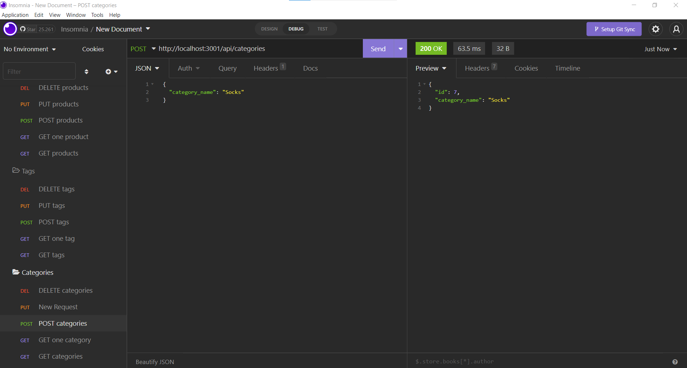
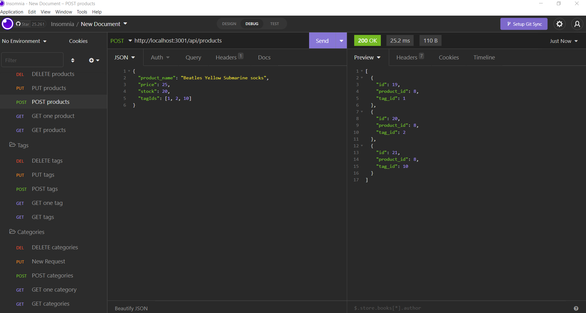
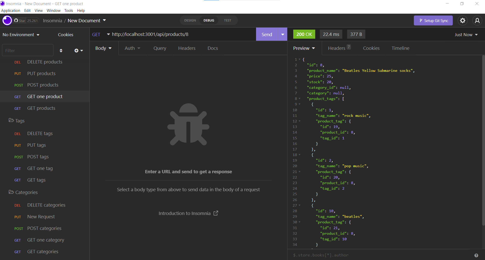

# E-commerce Back End

## Table of Contents
- [Project Description](#Project-Description)
- [User Story](#User-Story)
- [Screen Captures](#Screen-Captures)
- [Technologies](#Technologies)
- [Links](#Links)

## Project Description
In this project, the back end for an e-commerce site was developed by working with the Express.js API and using Sequelize to configure and interact with a MySQL database. Thanks to the implementation of Sequelize, it was possible to implement different models and routes to perform CRUD operations in an efficient and robust way. In addition, different relationships amongst the models were established to link data from different columns.
###### [Back to Index](#Table-of-Contents)

## User Story
```
AS A manager at an internet retail company
I WANT a back end for my e-commerce website that uses the latest technologies
SO THAT my company can compete with other e-commerce companies
```
###### [Back to Index](#Table-of-Contents)


## Screen Captures





###### [Back to Index](#Table-of-Contents)


## Technologies


###### [Back to Index](#Table-of-Contents)

## Links
- [Walkthrough Video](https://drive.google.com/file/d/1hBQGhoUeVq7c0Bdj4b0nH3qJ0bSgu65W/view?usp=sharing)
###### [Back to Index](#Table-of-Contents)